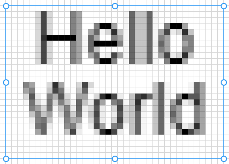

## Text Tool (<kbd>T</kbd>)

The _Text_ tool allows drawing text within the canvas, left click will use the primary color and right click will use the secondary color.

> ℹ️ Holding shift while the text tool is active will lock the aspect ratio to a square for new text, or the previous aspect ratio if resizing.

When text is drawn, handles appear which allow manipulating the text's dimensions. The following options are available to configure how the text is drawn:

- Blend mode
- Font family
- Font size
- Bold
- Italic
- Horizontal alignment
- Vertical alignment

Contextual information about the active text is shown in the bottom bar.

