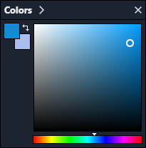
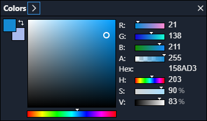

## Colors Window

The _Colors Window_ allows changing the _primary_ and _secondary colors_ which are associated with the left and right mouse buttons respectively in most tools.

The windows can be expanded to show individual channel values and sliders by hitting the `>` button in the top of the window:

More information:

- Transparent colors display over a checkered background.
- Pressing `x` will swap _primary_ and _secondary colors_.
- Sliders are available to change channels quickly, the mouse wheel can be used while hovering the slider to increment/decrement by 1.
- The window can be hidden by hitting the `X` icon and toggled via Luna's _Menu_, the command palette or `F8`.
