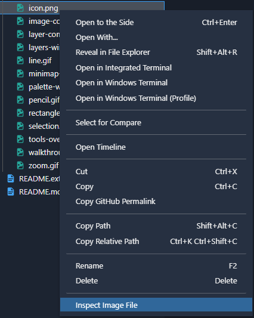
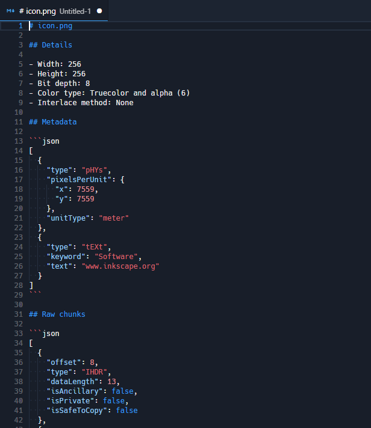

## Inspect Image File

The _Inspect Image File_ action is an advanced feature available for png files via the right click context menu in the explorer:

Clicking the entry will generate an untitled text file containing details the file's structure like the method in which is was encoded, what metadata is attached to the file, warnings/errors when decoding the file, etc.

